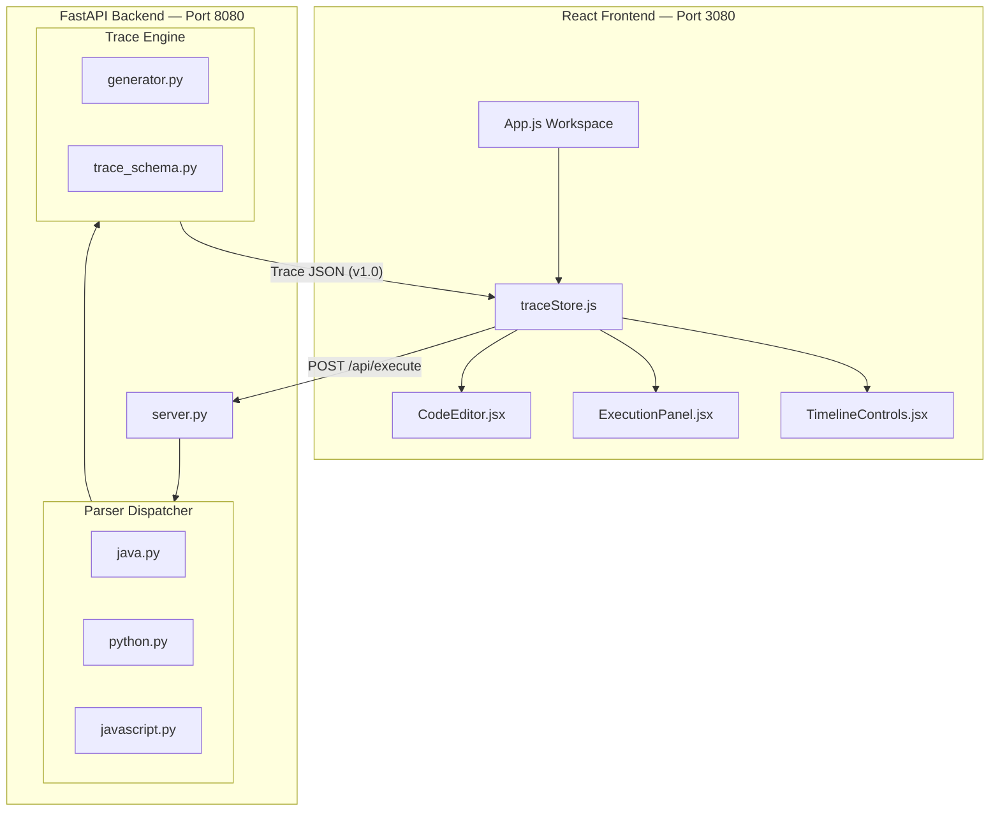
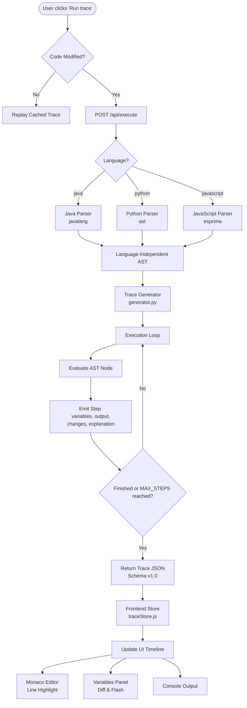

# Traceflow

> Traceflow helps you think like a programmer by turning code into step-by-step execution you can see, track, and understand.

Traceflow is an interactive learning tool that visualizes step-by-step code execution in real-time. Designed specifically for programming beginners, students, and self-taught developers, Traceflow allows you to write snippets, step through loops, inspect variable state changes, and read AI-powered line-by-line explanations.

---

## ✨ Features

- **Multi-Language Support**: Write and trace code in **Java**, **Python**, and **JavaScript**.
- **Three-Panel Workspace Layout**:
  - **Code Editor**: A custom-themed Monaco Editor with live current-line execution highlights and gutter indicators.
  - **Execution Timeline**: Play, pause, step forward/backward, and adjust playback speed dynamically.
  - **Variable & State Panel**: View exactly what variables exist, which ones changed at the current step (with visual diff flashes), and condition evaluation results.
- **Output Console**: An incremental log displaying output exactly as the program prints it.
- **Trace JSON Inspector**: A developer-focused overlay (`Ctrl + \``) to validate execution steps against the frozen TraceFlow Schema v1.0.
- **Local Persistence**: Automatically saves draft code modifications per sample program in browser `localStorage`.

---

## 🛠️ Architecture & Tech Stack

TraceFlow is built as a lightweight, database-free, in-memory execution pipeline:

- **Frontend**: React (Create React App) + Tailwind CSS + Zustand (state management) + `@monaco-editor/react`.
- **Backend**: FastAPI + Uvicorn.
- **Parsers & Generators**:
  - Java parsed via `javalang`.
  - Python parsed via the standard library `ast`.
  - JavaScript parsed via `esprima`.
  - Custom trace generator that executes the AST in-memory to produce execution steps conforming to **Schema v1.0**.

### 🏗️ System Architecture



### ⚙️ Trace Execution Pipeline



---


## 🚀 Getting Started

To run TraceFlow locally, follow these steps to start the backend and frontend.

### 1. Prerequisites
Ensure you have **Python 3.10+** and **Node.js (npm/npx)** installed on your machine.

---

### 2. Run the Backend (FastAPI)
1. Navigate to the `backend/` directory:
   ```bash
   cd backend
   ```
2. Install the Python dependencies:
   ```bash
   pip install fastapi uvicorn pydantic motor javalang esprima pytest pytest-xdist
   ```
3. Run the server using Uvicorn on port `8080` (configured to prevent conflicts):
   ```bash
   uvicorn server:app --host 127.0.0.1 --port 8080
   ```
4. Verify the backend is running by visiting [http://localhost:8080/api/](http://localhost:8080/api/).

---

### 3. Run the Frontend (React)
1. Navigate to the `frontend/` directory:
   ```bash
   cd ../frontend
   ```
2. Install the Node packages:
   ```bash
   npm install
   ```
3. Start the React development server:
   ```bash
   npm start
   ```
   *The frontend is pre-configured via `.env` to run on port **`3080`** (to avoid conflicting with other running projects) and point to the backend at `http://localhost:8080`.*
4. Open your browser to [http://localhost:3080](http://localhost:3080) to use the application.

---

## 🧪 Testing

We have a robust backend test suite with **104 tests** covering parser rejections, variable assignments, loops, prints, division edge cases, and API routers.

To run the backend tests:
1. Navigate to the `backend/` directory.
2. Run pytest:
   ```bash
   python -m pytest
   ```

---

## 🗺️ Project Backlog & Future Roadmap

TraceFlow runs on a pure in-memory execution engine. Future phases include:

1. **Phase 9 — AI Explanations**: Swapping the current templated mock step-by-step explanations with a live LLM integration (e.g., Claude/GPT).
2. **Layout Customization**: Making the three-panel workspace resizable using `react-resizable-panels`.
3. **Database Integration**: Introducing a persistent store (e.g., MongoDB) only when ready to build:
   - User accounts and progress tracking.
   - Saved code snippets in the cloud.
   - Shareable execution traces (unique shareable URLs).
   - History logs and usage analytics.

---

## 📄 License

This project is licensed under the Apache License 2.0. See the [LICENSE](LICENSE) file for the full text.

Copyright 2026 Akshay Suryawanshi.
Licensed under the Apache License, Version 2.0.
