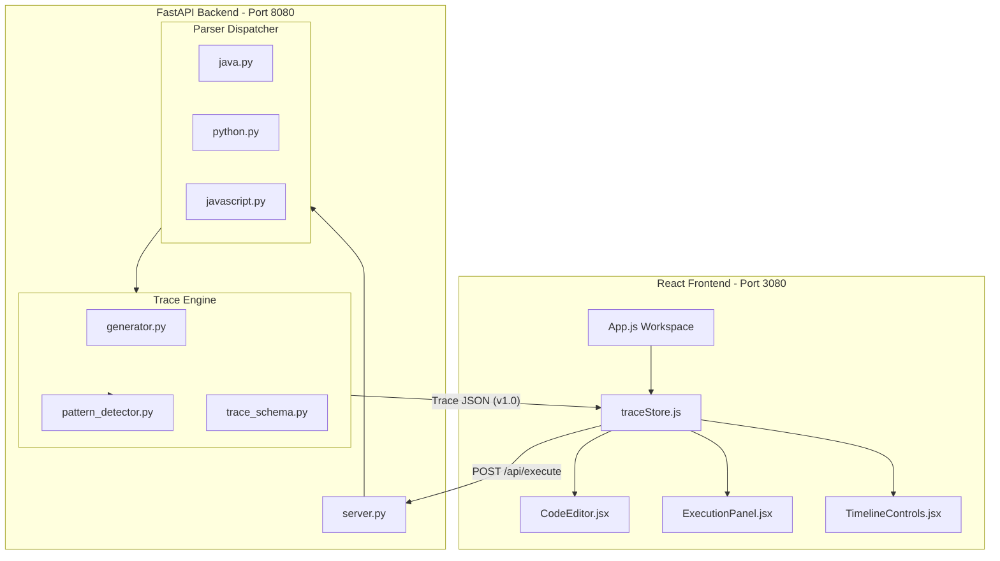
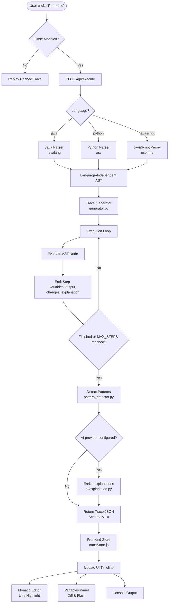

# TraceFlow — "Follow every step your code takes."

> TraceFlow helps you think like a programmer by turning code into step-by-step execution you can see, track, and understand.

TraceFlow is an interactive learning tool that visualizes step-by-step code execution in real-time. Designed for programming beginners, students, and self-taught developers, TraceFlow lets you write snippets, step through loops, inspect variable state changes, and read AI-powered line-by-line explanations.

---

## ✨ Features

- **Multi-Language Support**: Write and trace code in **Java**, **Python**, and **JavaScript**.
- **Arrays**: Declare arrays/lists, index into them (`b[i]`), and inspect each element as an index-labeled box in the variables panel.
- **Resizable Three-Panel Workspace** (`react-resizable-panels`):
  - **Code Editor**: Custom-themed Monaco Editor with live current-line execution highlights, gutter indicators, input variables, and breakpoints.
  - **Execution Panel**: Step-by-step execution with variable cards, visual diff flashes for changed values, loop indicators, condition evaluations, and a "What changed" feed.
  - **Explanation Panel**: Step-wise explanations, concept hints, and detected program patterns.
- **AI Explanations**: Choose a provider (Gemini, Groq, OpenRouter, or OpenAI) from Settings; the backend enriches each step with a live LLM explanation (falls back to templated text when AI is off or fails).
- **Practice Mode**: Toggle on to get a multiple-choice "predict the next step" quiz after each step; progress is blocked until you answer correctly.
- **Excel & Sheets Export**: Copy the entire execution trace table in a clean TSV (Tab-Separated Values) format with one click, including line numbers, statement execution, variables values, and line-by-line explanation text to paste directly into Excel or Google Sheets.
- **Conditional Breakpoints**: Set breakpoints on any line (with an optional condition) and playback pauses when one is hit.
- **Run Comparison**: Save a run as a baseline and step through two traces side-by-side to diff variables across versions.
- **Input Variables**: Edit detected input variables directly in the editor panel and re-run the trace with your own values.
- **Pattern Recognition**: The backend detects common programming patterns (Accumulation, Counter, Min/Max Search, Nested Loops) and surfaces them with complexity hints.
- **Output Console**: An incremental log displaying output exactly as the program prints it.
- **Trace JSON Inspector**: A developer overlay (`Ctrl/Cmd + \``) that validates every step against the frozen TraceFlow Schema v1.0.
- **Local Persistence**: Per-sample code drafts, language preference, and AI settings persist in browser `localStorage`.

---

## 🛠️ Architecture & Tech Stack

TraceFlow runs a lightweight, database-free, in-memory execution pipeline:

- **Frontend**: React (Create React App) + Tailwind CSS + Zustand + `@monaco-editor/react` + `react-resizable-panels`.
- **Backend**: FastAPI + Uvicorn.
- **Parsers & Generators**:
  - Java parsed via `javalang`.
  - Python parsed via the standard library `ast`.
  - JavaScript parsed via `esprima`.
  - A custom trace generator executes the language-independent AST in-memory to produce steps conforming to **Schema v1.0**.

### 🏗️ System Architecture



### ⚙️ Trace Execution Pipeline



> **Security model:** single-user, no accounts, self-hosted. The backend is open
> to any client that can reach it and is protected by CORS allowlist + rate
> limits. LLM API keys are user-supplied (or server env vars) and never logged.
> See **[`memory/SECURITY.md`](memory/SECURITY.md)** for the full access &
> security requirements.

---

## 🚀 Getting Started

### 1. Prerequisites

- **Python 3.10+**
- **Node.js** (npm/npx)

---

### 2. Run the Backend (FastAPI)

1. Navigate to the backend directory:
   ```bash
   cd backend
   ```
2. Create a virtual environment and install dependencies:
   ```bash
   python -m venv .venv
   .venv\Scripts\activate        # Windows
   # source .venv/bin/activate  # macOS / Linux
   pip install -r requirements.txt
   ```
3. (Optional) Configure AI providers:
   ```bash
   cp .env.example .env
   ```
   Add at least one API key (`GEMINI_API_KEY`, `GROQ_API_KEY`, `OPENROUTER_API_KEY`, or `OPENAI_API_KEY`). AI is optional — the app works fine without it.
4. Start the server on port `8080`:
   ```bash
   uvicorn server:app --host 127.0.0.1 --port 8080
   ```
5. Verify it's running at [http://localhost:8080/api/](http://localhost:8080/api/).

---

### 3. Run the Frontend (React)

1. Navigate to the frontend directory:
   ```bash
   cd ../frontend
   ```
2. Install dependencies:
   ```bash
   npm install
   ```
3. Start the dev server:
   ```bash
   npm start
   ```
   The frontend is pre-configured via `.env` to run on port **`3080`** and point to the backend at `http://localhost:8080`.
4. Open [http://localhost:3080](http://localhost:3080) to use the application.

---

## 🧪 Testing

The backend test suite (**144 tests**) covers parser behavior across Java/Python/JavaScript, schema conformance, variable assignments, loops, conditionals, arrays, prints, division edge cases, pattern detection, and the API routers.

```bash
cd backend
python -m pytest
```

---

## 🧩 Sample Traces

The app ships with canonical sample programs, one per concept, all verified step-for-step against the trace generator:

| ID                 | Concept        | Program                              |
| ------------------ | -------------- | ------------------------------------ |
| `for-loop-sum`     | `for-loop`     | Sum 1..3                             |
| `if-else-grade`    | `if-else`      | Grade check                          |
| `while-countdown`  | `while-loop`   | Countdown                            |
| `nested-loops-table` | `nested-loops` | Multiplication table (O(n²))       |
| `max-scan`         | `min-max`      | Find the largest value               |
| `flag-toggle`      | `flag`         | Toggle a boolean                     |
| `string-accum`     | `string-accum` | Build output with concatenation      |
| `array-sum`        | `arrays`       | Sum array elements with indexing     |

---

## 🗺️ Project Backlog & Future Roadmap

TraceFlow runs on a pure in-memory execution engine. Future work includes:

1. **More learning constructs**: Methods and recursion, multi-dimensional arrays, and additional language-specific features.
2. **Database Integration**: A persistent store when ready for:
   - User accounts and progress tracking.
   - Saved code snippets in the cloud.
   - Shareable execution traces (unique shareable URLs).
   - History logs and usage analytics.
3. **Collaboration & Sharing**: Sharing and live-collaboration features.

---

## 📄 License

This project is licensed under the Apache License 2.0. See the [LICENSE](LICENSE) file for the full text.

Copyright 2026 Akshay Suryawanshi.
Licensed under the Apache License, Version 2.0.
